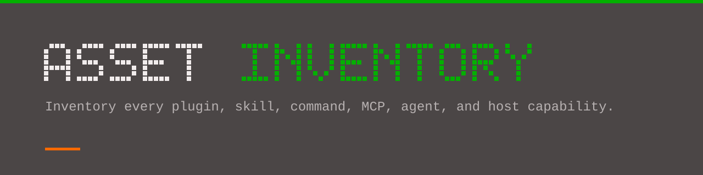

<div align="center">


# 🗃️ Asset Inventory

**Conoce exactamente qué puede invocar tu entorno de OpenCode: cada plugin, skill, comando, servidor MCP, agente y capacidad del host, con su procedencia.**

[](LICENSE)
[](#compatibility)

[English](README.md) · [中文](README-ZH.md) · [日本語](README-JA.md) · [한국어](README-KO.md) · [Русский](README-RU.md) · [العربية](README-AR.md) · [Español](README-ES.md)



</div>

**asset-inventory** es un skill de OpenCode que inventaría tu entorno de una sola vez: todos los plugins, skills, comandos, servidores MCP, agentes y capacidades de la app externa de tu máquina, con **procedencia** (de dónde vino). Cada fila responde a tres preguntas: **qué es, quién lo trajo y cómo se usa**. 🎯

## 🚀 Inicio rápido

```
/asset-inventory
```

Instala el skill y ejecútalo. No requiere configuración. Añade un argumento para cubrir solo una parte: `/asset-inventory mcp`, `agents`, `hosts`, `skills`, `diff`, `usage`.

## 📦 Instalación

> 🌍 **Recomendado: instalación global.** Una copia para instalar y actualizar, disponible en todos los proyectos.

```sh
git clone https://github.com/sogeisetsu/asset-inventory.git
cd asset-inventory
# copia solo SKILL.md y references/ a tu carpeta de skills
```

- **Global:** `~/.config/opencode/skills/asset-inventory/`
- **En el proyecto:** `<project-root>/.opencode/skills/asset-inventory/`

📖 Pasos completos (todas las plataformas), autoinstalación con IA y actualización → **[Instalación y actualización](docs/guides/install-and-update.md)**

## 📤 Resultado

```
your-project-root/
└── output/
    ├── inventory.md         # el inventario de 7 tablas
    ├── usage-guide.md       # guía de «cuándo usarlo», por escenario y frecuencia
    └── asset-inventory.json # filas legibles por máquina (clave table + name)
```

👀 **Ejemplos reales:** 📄 [inventory.md](docs/samples/inventory.md) · 🧭 [usage-guide.md](docs/samples/usage-guide.md) · 🧾 [asset-inventory.json](docs/samples/asset-inventory.json)

## ✨ Aspectos destacados

- 🧭 **Procedencia** — integrado en OpenCode, aportado por un plugin, creado por ti o inyectado por el host. Un skill gestionado por un plugin se atribuye al plugin, nunca se etiqueta como «local».
- 🚦 **Cuatro estados** — ✅disponible / ❌deshabilitado / 📦solo en estante / 🚫ausente
- 🔒 **Solo lectura y enmascarado** — no cambia la configuración; oculta claves, rutas y nombres privados
- 🖥️ **Consciente del host** — escanea el binario del paquete y halla comandos inyectados que grep no ve
- 🔀 **Modo diff** — pega el JSON anterior y obtén solo altas y bajas
- 🌐 **Salida multilingüe** — el resultado sigue el idioma del usuario

## 📚 Guías detalladas

| Guía | Contenido |
|---|---|
| 🧠 [Cómo funciona](docs/guides/how-it-works.md) | Idea central, las 7 tablas, procedencia, los tres archivos |
| 📦 [Instalación y actualización](docs/guides/install-and-update.md) | Todas las plataformas, autoinstalación con IA, `update.ps1` |
| 🧭 [Repositorio y contribución](docs/guides/repository-and-contributing.md) | Qué leer, estructura, contribuir, versiones |

## 🔗 Enlaces

- 🖥️ **Página de inicio:** <https://sogeisetsu.github.io/asset-inventory/>
- 📝 **Registro de cambios:** [CHANGELOG.md](CHANGELOG.md)
- 🤝 **Contribuir:** [CONTRIBUTING.md](CONTRIBUTING.md)

## ✅ Compatibilidad

**Alcance: este skill solo se ha probado en OpenCode** (incluidas apps externas que envuelven OpenCode, como OpenChamber). **No está verificado en otros asistentes de código** (Claude Code, Cursor, Windsurf, etc.).

Requiere [OpenCode](https://opencode.ai) (los skills se cargan bajo demanda con la herramienta nativa `skill`).

## 📄 Licencia

MIT — ver [LICENSE](LICENSE).
